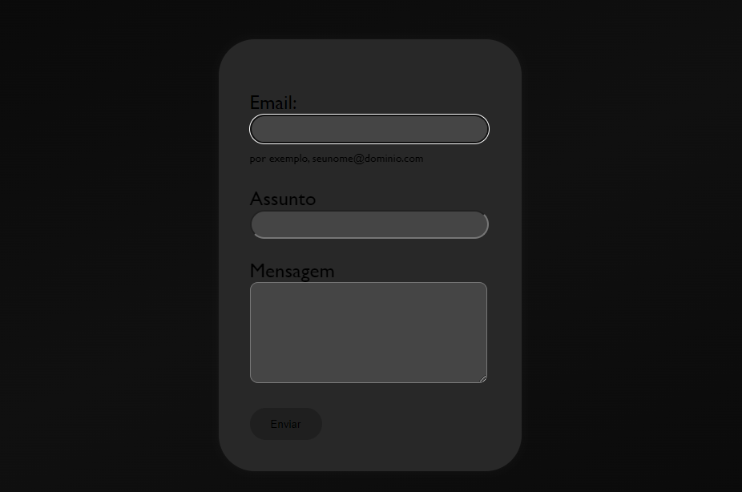

# Formulário de contatos

## 📝Indicie

⚙️- Códigos 

* [Elementos](#elementos)
* [Atributos](#atributos)
* [Informações](#informações)

### 📍Elementos

### 🔹&lt;form&gt;
O elemento HTML representa uma seção do documento contendo controles interativos para envio de informações.<form>

### 🔹&lt;p&gt;

Os parágrafos são geralmente representados em mídia visual como blocos de texto separados de blocos adjacentes por linhas em branco e/ou recuo de primeira linha, mas os parágrafos HTML podem ser qualquer agrupamento estrutural de conteúdo relacionado, como imagens ou campos de formulário.

### 🔹&lt;Label&gt;

O elemento HTML representa uma legenda para um item em uma interface de usuário. <label>

### 🔹&lt;Input&gt;

O elemento HTML é usado para criar controles interativos para formulários baseados na web para aceitar dados do usuário; uma ampla variedade de tipos de dados de entrada e widgets de controle estão disponíveis, dependendo do dispositivo e do agente do usuário . O elemento é um dos mais poderosos e complexos de todo HTML devido ao grande número de combinações de tipos de entrada e atributos.

### 🔹&lt;Span&gt;

O elemento HTML é um contêiner embutido genérico para expressar conteúdo, que não representa nada inerentemente. Ele pode ser usado para agrupar elementos para fins de estilo (usando os atributos ou ) ou porque eles compartilham valores de atributos, como . Deve ser usado somente quando nenhum outro elemento semântico for apropriado. é muito parecido com um elemento, mas é um elemento de nível de bloco , enquanto a é um elemento de nível embutido . 

### 🔹&lt;Textarea&gt;

O elemento HTML representa um controle de edição de texto simples de múltiplas linhas, útil quando você deseja permitir que os usuários insiram uma quantidade considerável de texto de formato livre, por exemplo, um comentário em um formulário de revisão ou feedback.< textarea >

### 🔹&lt;Button&gt;

O elemento HTML é um elemento interativo ativado por um usuário com mouse, teclado, dedo, comando de voz ou outra tecnologia assistiva. Uma vez ativado, ele executa uma ação, como enviar um formulário ou abrir uma caixa de diálogo.< button >

### 🔹&lt;H1&gt;

 - Os elementos HTML < h1 > a < h6 > representam seis níveis de títulos de seção. < h1 > é o nível de seção mais alto e < h6 > é o mais baixo. Por padrão, todos os elementos de título criam uma caixa em nível de bloco no layout, começando em uma nova linha e ocupando toda a largura disponível no bloco que os contém.

### 📍Atributos 

### 🔹 Methood 

O atributo method define qual o método HTTP para enviar os dados (ele pode ser "GET" ou "POST" (veja as diferenças aqui).

### 🔹 For 

O foratributo é um atributo permitido para < label >e < output >. Quando usado em um < label > elemento, indica o elemento do formulário que este rótulo descreve. Quando usado em um < output > elemento, permite um relacionamento explícito entre os elementos que representam valores usados ​​na saída.

### 🔹 Type 

o type é usado para especificar o tipo de conteúdo que essa tag link está importando, o valor do atributo deve ser um MIME type como "text/html", "text/css" e assim por diante.

### 🔹 Id 

O atributo Id especifica uma identificação única para o elemento HTML. Por questões de boas práticas, não deve ser reutilizado e nem conter espaços em seu nome, pois o navegador irá identificar o espaço como parte dele, já que os elementos não podem ter mais de um Id.

# 📜Informações

## Fontes

[form-element](gg.gg/form-element)

## Tecnologias utilizadas

_**hmtl5**_ e _**ccs3**_

## Colaboradores

Thay, Luamy, Sarah e Evillin.

## Status de conclusão

iniciado 20/09 - Terminado ?
